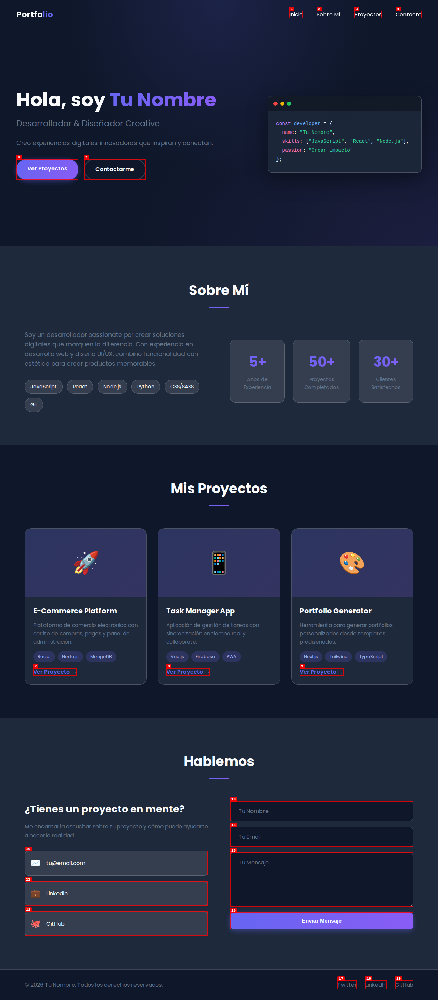
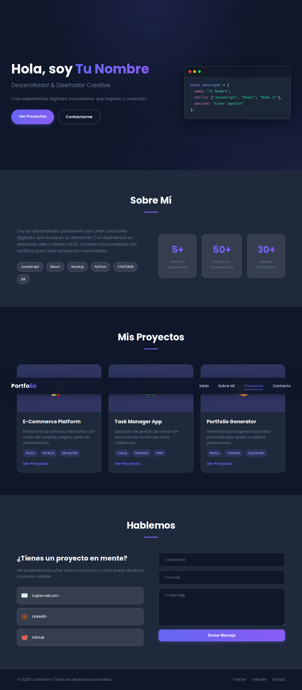
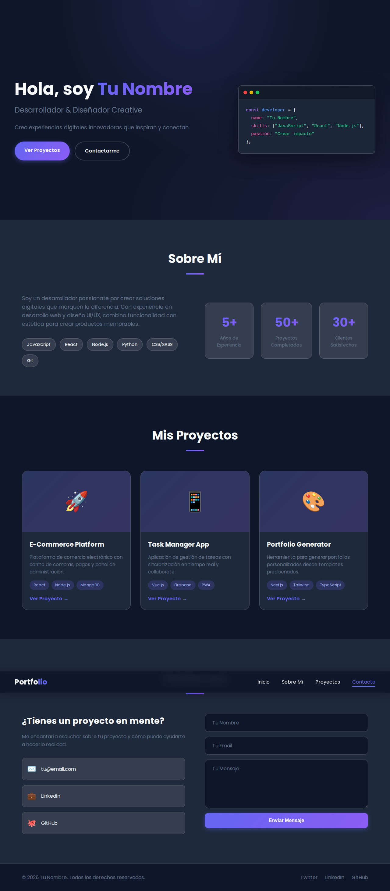

# Portfolio Personal

¡Bienvenido a mi portfolio personal! Este es un sitio web de presentación profesional con un diseño moderno y minimalista.



## 🚀 Características

- **Diseño Responsive** - Se adapta perfectamente a todos los dispositivos
- **Tema Oscuro Moderno** - Estética profesional con colores vibrantes
- **Efectos de Vidrio (Glassmorphism)** - Elementos translúcidos con desenfoque
- **Navegación Suave** - Scroll animado entre secciones
- **Sección de Proyectos** - Tarjetas interactivas con tags de tecnología
- **Formulario de Contacto** - Diseño limpio y funcional
- **Código Visual** - Elemento decorativo de código en la hero section

## 🛠️ Tecnologías

- HTML5 semántico
- CSS3 con variables personalizadas
- JavaScript vanilla para interactividad
- Google Fonts (Poppins)
- Diseñado sin frameworks para máximo rendimiento

## 📱 Vista Previa

### Sección Hero


### Proyectos


### Contacto


## 🌐 Demo

Visita el sitio en vivo: **[filiposoul.github.io/portfolio-prueba](https://filiposoul.github.io/portfolio-prueba/)**

## 📦 Instalación Local

```bash
# Clona el repositorio
git clone https://github.com/FilipoSoul/portfolio-prueba.git

# Abre en tu navegador
cd portfolio-prueba
open index.html
```

O simplemente haz doble clic en `index.html` para abrirlo en tu navegador.

## 🎨 Personalización

### Cambiar el nombre
Edita el archivo `index.html` y busca:
```html
<h1>Hola, soy <span class="highlight">Tu Nombre</span></h1>
```

### Cambiar colores
Edita `styles.css` y modifica las variables:
```css
:root {
    --primary: #6366f1;
    --primary-dark: #4f46e5;
    --secondary: #10b981;
    --dark-bg: #0f172a;
}
```

### Agregar proyectos
En `index.html`, duplica el siguiente bloque:
```html
<article class="project-card">
    <div class="project-image">
        <div class="project-placeholder">🚀</div>
    </div>
    <div class="project-info">
        <h3>Nombre del Proyecto</h3>
        <p>Descripción del proyecto</p>
        <div class="project-tags">
            <span>Tecnología 1</span>
            <span>Tecnología 2</span>
        </div>
        <a href="#" class="project-link">Ver Proyecto →</a>
    </div>
</article>
```

## 📄 Licencia

MIT License - Feel free to use this template for your own portfolio!

---

⭐️ ¡Si te gusta este proyecto, no olvides darle una estrella!
